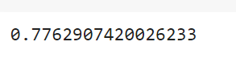

# Implementation-of-Logistic-Regression-Using-Gradient-Descent

## AIM:
To write a program to implement the the Logistic Regression Using Gradient Descent.

## Equipments Required:
1. Hardware – PCs
2. Anaconda – Python 3.7 Installation / Jupyter notebook

## Algorithm
1. Import the packages required.
2. Read the dataset.
3. Define X and Y array.
4. Define a function for costFunction,cost and gradient.
5. Define a function to plot the decision boundary and predict the Regression value.

## Program:

Program to implement the the Logistic Regression Using Gradient Descent.

Developed by: Sneha Basyal M

RegisterNumber: 212222240101
```
import numpy as np
import matplotlib.pyplot as plt
from scipy import optimize

data=np.loadtxt("/content/ex2data1.txt",delimiter=',')
x=data[:,[0,1]]
y=data[:,2]

x[:5]

y[:5]

plt.figure()
plt.scatter(x[y==1][:,0],x[y==1][:,1],label="Admitted")
plt.scatter(x[y==0][:,0],x[y==0][:,1],label="Not admitted")
plt.xlabel("Exam 1 score")
plt.ylabel("Exam 2 score")
plt.legend()
plt.show()

def sigmoid(z):
  return 1/(1+np.exp(-z))

plt.plot()
x_plot=np.linspace(-10,10,100)
plt.plot(x_plot,sigmoid(x_plot))
plt.show()

def costFunction(theta,x,y):
  h=sigmoid(np.dot(x,theta))
  J=-(np.dot(y,np.log(h)) + np.dot(1-y,np.log(1-h)))/x.shape[0]
  grad=np.dot(x.T,h-y)/x.shape[0]
  return J,grad

x_train=np.hstack((np.ones((x.shape[0],1)),x))
theta=np.array([0,0,0])
J,grad=costFunction(theta,x_train,y)
print(J)
print(grad)

x_train=np.hstack((np.ones((x.shape[0],1)),x))
theta=np.array([-24,0.2,0.2])
J,grad=costFunction(theta,x_train,y)
print(J)
print(grad)

def cost(theta,x,y):
  h=sigmoid(np.dot(x,theta))
  J=-(np.dot(y,np.log(h))+np.dot(1-y,np.log(1-h)))/x.shape[0]
  return J

x_train=np.hstack((np.ones((x.shape[0],1)),x))
theta=np.array([0,0,0])
res=optimize.minimize(fun=cost,x0=theta,args=(x_train,y),method='Newton-CG',jac=gradient)
print(res.fun)
print(res.x)

def plotDecisionBoundary(theta,x,y):
  x_min,x_max=x[:,0].min() - 1,x[:,0].max()+1
  y_min,y_max=x[:,1].min() - 1,x[:,1].max()+1
  xx,yy=np.meshgrid(np.arange(x_min,x_max,0.1),np.arange(y_min,y_max,0.1))

  x_plot=np.c_[xx.ravel(),yy.ravel()]
  x_plot=np.hstack((np.ones((x_plot.shape[0],1)),x_plot))
  y_plot=np.dot(x_plot,theta).reshape(xx.shape)

  plt.figure()
  plt.scatter(x[y==1][:,0],x[y==1][:,1],label="Admitted")
  plt.scatter(x[y==0][:,0],x[y==0][:,1],label="Not Admitted")
  plt.contour(xx,yy,y_plot,levels=[0])
  plt.xlabel("Exam 1 score")
  plt.ylabel("Exam 2 score")
  plt.legend()
  plt.show()
  
plotDecisionBoundary(res.x,x,y)

prob=sigmoid(np.dot(np.array([1,45,85]),res.x))
print(prob)

def predict(theta,x):
  x_train=np.hstack((np.ones((x.shape[0],1)),x))
  prob=sigmoid(np.dot(x_train,theta))
  return (prob>=0.5).astype(int)

np.mean(predict(res.x,x)==y)
```

## Output:

### ARRAY VALUE OF X


### ARRAY VALUE OF Y


### EXAM 1-SCORE GRAPH


### SIGMOID FUNCTION GRAPH


### X_TRAIN_GRAD VALUE


### Y_TRAIN_GRAD VALUE


### PRINT res.x


### DECISION BOUNDARY - GRAPH FOR EXAM SCORE


### PROBABILITY VALUE


### PREDICTION VALUE OF MEAN


## Result:
Thus the program to implement the the Logistic Regression Using Gradient Descent is written and verified using python programming.

